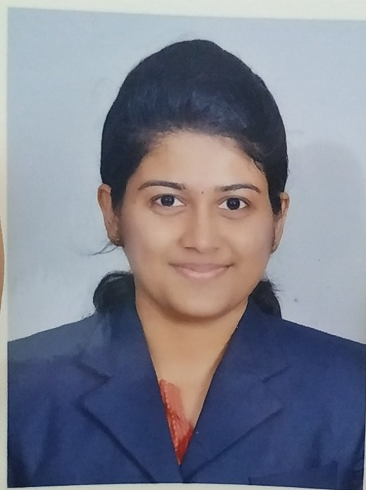

>[deepshikahari1998@gmail.com](mailto:deepshikahari1998@gmail.com) | 
[8667210320](tel:8667210320)

# Deepshika Hari
Software Engineering Aspirant who aims to being a part of an organisation and work with full knowledge and effort to enhance the company's growth and development.

## Education
**Velammal College Of Engineering And Technology**  
 B.Tech in Information Technology  
*CGPA 8.24*  
*May 2020*  
**Mahatma Montessori Matriculation Higher Secondary School**  
 HSC  
*Percentage 88%*  
*May 2016*  
**Velammal Matriculation Higher Secondary School**  
 SSLC  
*Percentage 96%*  
*May 2014*   

## Tools
- Front End Languages &ndash; HTML, CSS 
- Back End Languages &ndash; PHP, Servlet
- Database Languages &ndash; MySQL
- Programming Languages &ndash; C, C++, Java

## Certifications
- **C PROGRAMMING CERTIFICATION**  
Kalvi Instituite, Madurai. 
*Jan 2018 &ndash; Jun 2018*
- **JAVA PROGRAMMING CERTIFICATION**  
NIIT, Madurai. 
*Jan 2019 &ndash; Jun 2019* 

## In-Plant Trainings

|Sl.No|Name Of the Institute|Course|Duration|
|-----|---------------------|------|--------|
|1|OneYes Technologies, Chennai|Web Development|6 months|
|2|CodeBind Technologies, Trichy|Web Development|6 months|

